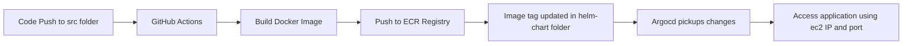

# 🚀 Zero Touch Automation using CI/CD Pipeline with GitHub Actions & Docker & k8s


## ✨ Features

- **Automated Testing**: Jest/Mocha tests run on every push
- **Docker Build**: Containerization with multi-stage builds
- **Self-Hosted Deployment**: no need to build or push images and apply changes
- **No VM Required**: Entire CI pipeline executes locally
- **Real-time Monitoring**: Dashboard shows deployment status

## 🛠️ Technology Stack

| Component             | Technology                          |
|-----------------------|-------------------------------------|
| CI/CD Pipeline        | GitHub Actions                      |
| Containerization      | Docker with ECR                     |
| Orchestration         | Kubernetes & Argocd                 |
| Monitor               | Prometheus + Grafana                |


## ⚙️ How It Works



## 🚀 Getting Started

### Prerequisites
- Provide AWS_ACCESS_KEY_ID, AWS_SECRET_ACCESS_KEY, AWS_ACCOUNT_ID, in github secrets
- k8s cluster running and argocd is installed 


## 📂 Project Structure
```
CI-CD-Pipeline-with-GitHub-Actions-Docker/
├── .github/
│   └── workflows/
│       └── ci-cd.yml
├── helm-chart/
├── terraform/
│   ├── main.tf
│   └── user_data.sh 
├── src/
│   ├── app.js
│   └── test/
│       └── test.js
├── Dockerfile
├── docker-compose.yml
├── package.json
└── README.md
```

## 🌐 Access the Application
After successful deployment:
```
http://localhost:3000
```
## Future Work
1. Automate the infrastructure creation using github workflows and terraform.
infrastructure is vpc, private subnets, ec2, security group. 
2. Using s3 as backend to store terraform.tfstate file.
