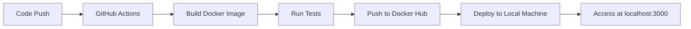

# 🚀 CI/CD Pipeline with GitHub Actions & Docker

[](https://github.com/AnugrahMassey/CI-CD-Pipeline-with-GitHub-Actions-Docker/actions)
[](https://hub.docker.com/r/anugrah28/ci-cd-demo)

A fully automated CI/CD pipeline using GitHub Actions and Docker that builds, tests, and deploys applications locally without cloud services.


## ✨ Features

- **Automated Testing**: Jest/Mocha tests run on every push
- **Docker Build**: Containerization with multi-stage builds
- **Self-Hosted Deployment**: Runs on your local machine
- **No Cloud Required**: Entire pipeline executes locally
- **Real-time Monitoring**: Dashboard shows deployment status

## 🛠️ Technology Stack

| Component             | Technology                          |
|-----------------------|-------------------------------------|
| CI/CD Pipeline        | GitHub Actions                      |
| Containerization      | Docker                              |
| Web Framework         | Node.js + Express                   |
| Testing Framework     | Mocha + Chai                        |
| Local Orchestration   | Docker Compose                      |
| Deployment            | Self-Hosted Runner                  |

## ⚙️ How It Works



## 🚀 Getting Started

### Prerequisites
- Docker
- Node.js 18+
- Git

### Local Installation
```bash
# Clone repository
git clone https://github.com/AnugrahMassey/CI-CD-Pipeline-with-GitHub-Actions-Docker.git
cd CI-CD-Pipeline-with-GitHub-Actions-Docker

# Install dependencies
npm install

# Run locally
npm start
```

### Pipeline Setup
1. Set up a self-hosted runner:
```bash
mkdir ~/actions-runner && cd ~/actions-runner
curl -o actions-runner-linux-x64.tar.gz -L https://github.com/actions/runner/releases/download/vX.X.X/actions-runner-linux-x64-X.X.X.tar.gz
tar xzf actions-runner-linux-x64.tar.gz
./config.sh --url https://github.com/AnugrahMassey/CI-CD-Pipeline-with-GitHub-Actions-Docker --token YOUR_TOKEN
./run.sh
```

2. Add GitHub Secrets:
   - `DOCKERHUB_USERNAME`
   - `DOCKERHUB_TOKEN`

## 📊 Pipeline Workflow


## 📂 Project Structure
```
CI-CD-Pipeline-with-GitHub-Actions-Docker/
├── .github/
│   └── workflows/
│       └── ci-cd.yml
├── src/
│   ├── app.js
│   └── test/
│       └── test.js
├── Dockerfile
├── docker-compose.yml
├── package.json
└── README.md
```

## 🌐 Access the Application
After successful deployment:
```
http://localhost:3000
```

## 📝 Project Report
[Download Project Report PDF](https://github.com/user-attachments/files/20777271/CI_CD.Pipeline.PR.pdf)

## 🤝 Contributing
Pull requests are welcome! For major changes, please open an issue first to discuss the changes you'd like to make.

